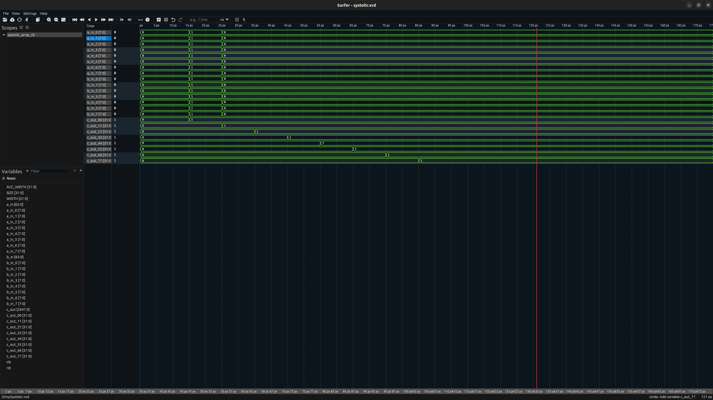

# 8x8 Systolic Array — Output Stationary Matrix Multiplier

## Waveforms in Surfer


Parameterized 8x8 systolic array in SystemVerilog computing C = A x B. Each processing element accumulates its partial sum in place while both operands stream through, targeting the Terasic DE10-Lite (Intel MAX 10).

## Architecture

### Processing Element

Each PE performs one multiply-accumulate per clock cycle. It receives an 8-bit signed value from the left (`a_in`) and from above (`b_in`), computes their product, and adds it to a 32-bit accumulator (`acc_out`). Both values are passed to the next PE through registered outputs (`a_out`, `b_out`), introducing exactly one cycle of delay per hop.

### Array Topology

64 PEs in an 8x8 grid. Row `i` of A enters at `a_in[i]` and flows right. Column `j` of B enters at `b_in[j]` and flows down. When computation completes, PE[i][j] holds the dot product of row `i` of A with column `j` of B.

### Output Stationary Dataflow

Both A and B stream through the array while partial sums accumulate in place. The accumulator never leaves the PE until the full dot product is done, minimizing memory bandwidth for intermediate results. Google's TPU v1 uses this same dataflow.

### Data Flow

Feeding the array is equivalent to launching two orthogonal wave pulses: one moving right through rows, one moving down through columns. The PE pipeline registers delay each wavefront by one cycle per hop. A non-zero product accumulates only where both waves arrive at the same PE in the same cycle. For an identity matrix input, that intersection is exactly the main diagonal. PE[i][i] sees `1 x 1` once; every other PE sees `1 x 0` or `0 x 1`. The result is the identity matrix in `c_out`, settled in `2*SIZE - 1` cycles.

## Repository Structure

```
rtl/
  pe.sv                   Processing element
  systolic_array.sv       8x8 PE array
tb/
  systolic_array_tb.sv    Identity matrix testbench
TOOLCHAIN.md              Simulation and linting setup
```

## Simulation

See [TOOLCHAIN.md](TOOLCHAIN.md) for compilation and waveform instructions.

The testbench feeds an identity matrix and checks `c_out[i][i] == 1` for all diagonal elements and `c_out[i][j] == 0` for all off-diagonal elements. The wait of `SIZE * 2 - 1` cycles is exact: `(SIZE-1) + (SIZE-1)` cycles for the wavefront to reach PE[7][7], plus one cycle for the accumulator to register the final product. A clean run produces no output. Any mismatch prints an error with the expected and actual value.

## Target Hardware

Terasic DE10-Lite — Intel MAX 10 (10M50DAF484C7G)

| Resource | Available |
|---|---|
| Logic Elements | 50,000 |
| M9K Memory | 1,638 Kbits |
| 18x18 Multipliers | 144 |
| PLLs | 4 |
| External SDRAM | 64MB, 16-bit bus |
| Clock | 50 MHz |
| I/O | 10 LEDs, 10 switches, 2 push buttons, six 7-segment displays, 2x20 GPIO, Arduino R3 header |

The 8x8 array uses 64 of the 144 available hardware multipliers.

## Future Work

Next step is a Platform Designer system in Quartus 25.1 connecting the array to a DMA engine and on-chip memory over Avalon-MM. The DMA engine streams matrix operands directly into the array without CPU intervention and reads results back for display. A live hardware demonstration format for the DE10-Lite's peripherals is still being decided.